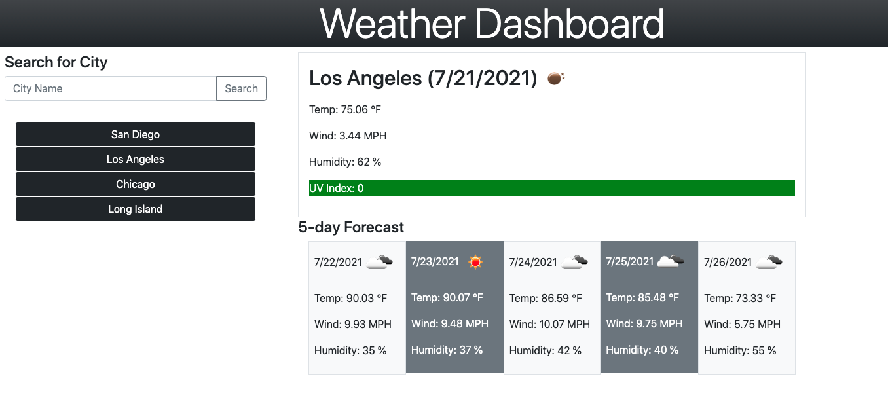

# Weather-Dashboard
## Overview
For this assignment we were tasked to create a weather dashboard. For this assignment we needed to use the open weather API and have a search function in which users would be able to search for a city and get today's weather along with the 5 day forecast. We needed to show a picture of the weather and provide temperature, humidity, wind speed & UV Index.


## Acceptance Criteria
```
GIVEN a weather dashboard with form inputs
WHEN I search for a city
THEN I am presented with current and future conditions for that city and that city is added to the search history
WHEN I view current weather conditions for that city
THEN I am presented with the city name, the date, an icon representation of weather conditions, the temperature, the humidity, the wind speed, and the UV index
WHEN I view the UV index
THEN I am presented with a color that indicates whether the conditions are favorable, moderate, or severe
WHEN I view future weather conditions for that city
THEN I am presented with a 5-day forecast that displays the date, an icon representation of weather conditions, the temperature, the wind speed, and the humidity
WHEN I click on a city in the search history
THEN I am again presented with current and future conditions for that city
```



## Learning

With this assignment I felt we definitely were able to test our skills with everything we learned so far and put them to the test. I was able to learn more about APIs and be able to get data from them and manipulate items on the page based on data from them. I was also able to practice my bootstrap skills. 